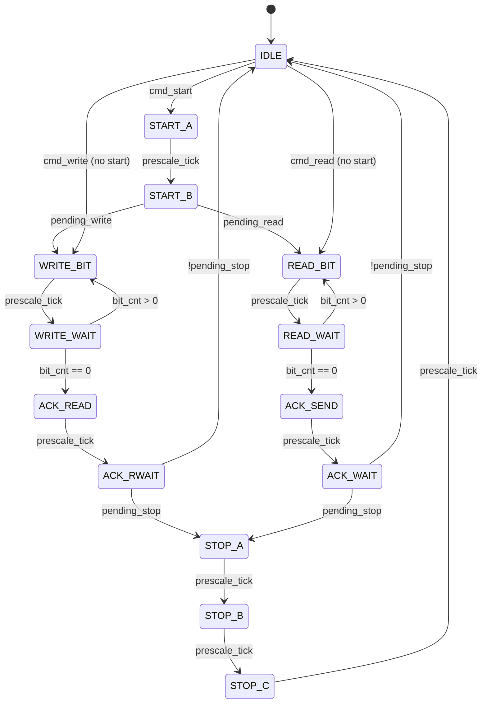
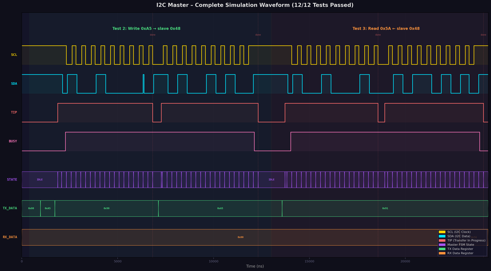
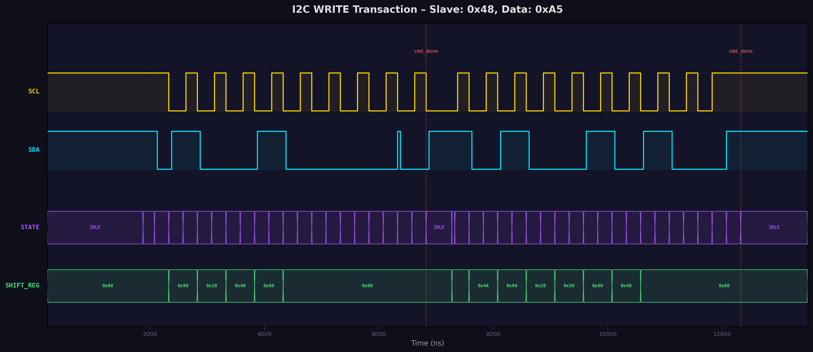
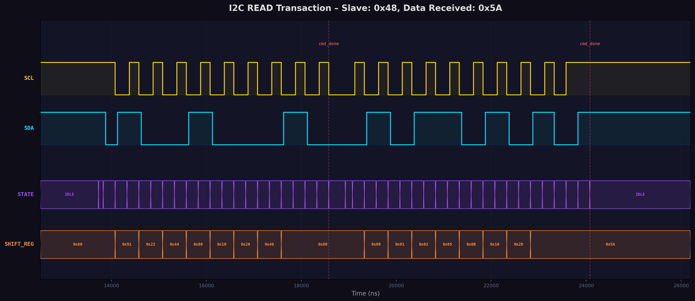
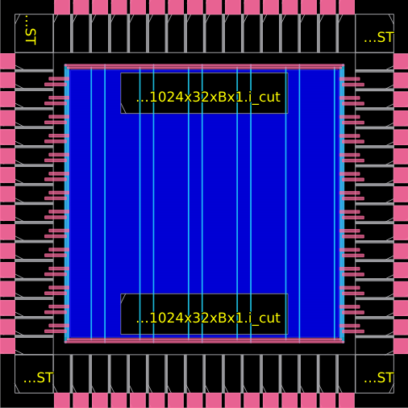
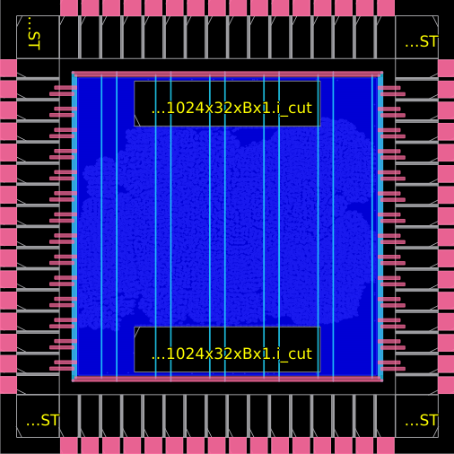
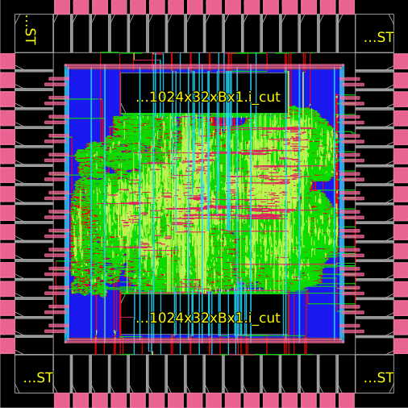

# BÁO CÁO ĐỒ ÁN CUỐI KỲ

## CE2024 Module 2 – Công cụ EDA mã nguồn mở cho Thiết kế IC Số

---

**Đề tài:** Thiết kế lõi CPU RISC-V tích hợp giao tiếp I2C trên nền tảng SoC croc  
**Sinh viên:** Nguyễn Minh Trí  
**Học kỳ:** 2024-2025  

---

## MỤC LỤC

1. [Tổng quan dự án](#1-tổng-quan-dự-án)
2. [Kiến trúc hệ thống](#2-kiến-trúc-hệ-thống)
3. [Thiết kế I2C Master](#3-thiết-kế-i2c-master)
4. [Mô phỏng và Kiểm chứng](#4-mô-phỏng-và-kiểm-chứng)
5. [Luồng thiết kế ASIC](#5-luồng-thiết-kế-asic)
6. [Kết luận và Hướng phát triển](#6-kết-luận-và-hướng-phát-triển)

---

## 1. Tổng quan dự án

### 1.1 Mục tiêu
Thiết kế và tích hợp một khối ngoại vi I2C Master vào SoC croc (pulp-platform), sau đó thực hiện toàn bộ luồng thiết kế ASIC backend sử dụng công cụ mã nguồn mở.

### 1.2 Nền tảng
| Thành phần | Chi tiết |
|---|---|
| **SoC** | pulp-platform/croc – SoC giáo dục dựa trên PULP |
| **CPU Core** | CV32E40P – RISC-V RV32IMC ISA |
| **PDK** | IHP 130nm (sg13g2) |
| **Synthesis** | Yosys |
| **Place & Route** | OpenROAD |
| **Simulation** | Icarus Verilog 12.0 + GTKWave |
| **Compiler** | riscv32-unknown-elf-gcc |

### 1.3 Các giai đoạn thực hiện

| Giai đoạn | Nội dung | Trạng thái |
|---|---|---|
| Phase 1 | Nghiên cứu đặc tả & phân tích yêu cầu | ✅ Hoàn thành |
| Phase 2 | Thiết kế RTL (SystemVerilog) | ✅ Hoàn thành |
| Phase 3 | Mô phỏng & Kiểm chứng | ✅ Hoàn thành |
| Phase 4 | Luồng thiết kế ASIC (Synthesis → PnR) | ✅ Hoàn thành |
| Phase 5 | Tài liệu & Báo cáo | ✅ Hoàn thành |

---

## 2. Kiến trúc hệ thống

### 2.1 Sơ đồ khối SoC croc

```
┌─────────────────────────────────────────────────────────────┐
│                        croc_chip                            │
│  ┌───────────────────────────────────────────────────────┐  │
│  │                     croc_soc                          │  │
│  │  ┌──────────┐    ┌──────────────────────────────┐     │  │
│  │  │ CV32E40P │    │        OBI Crossbar          │     │  │
│  │  │ RV32IMC  │───▶│  (Memory-Mapped Bus Fabric)  │     │  │
│  │  │   Core   │    └──────┬───┬───┬───┬───┬───────┘     │  │
│  │  └──────────┘           │   │   │   │   │             │  │
│  │                    ┌────┘   │   │   │   └────┐        │  │
│  │                    ▼        ▼   ▼   ▼        ▼        │  │
│  │               ┌────────┐ ┌───┐ ┌────┐ ┌────┐ ┌─────┐ │  │
│  │               │  SRAM  │ │TMR│ │UART│ │GPIO│ │ I2C │ │  │
│  │               │ 2×512B │ │   │ │    │ │    │ │(NEW)│ │  │
│  │               └────────┘ └───┘ └────┘ └────┘ └──┬──┘ │  │
│  │                                                  │    │  │
│  └──────────────────────────────────────────────────┼────┘  │
│                                                     │       │
│                                              ┌──────┴─────┐ │
│                                              │  I2C Pads  │ │
│                                              │ SCL    SDA │ │
│                                              └────────────┘ │
└─────────────────────────────────────────────────────────────┘
```

### 2.2 Bản đồ địa chỉ bộ nhớ

| Peripheral | Base Address | Size | Mô tả |
|---|---|---|---|
| Boot ROM | `0x0000_0000` | 1 KB | Khởi động |
| SRAM Bank 0 | `0x0010_0000` | 512 B | Bộ nhớ dữ liệu |
| SRAM Bank 1 | `0x0010_0200` | 512 B | Bộ nhớ dữ liệu |
| SoC Control | `0x2000_0000` | 4 KB | Cấu hình hệ thống |
| UART | `0x2000_1000` | 4 KB | Giao tiếp nối tiếp |
| GPIO | `0x2000_2000` | 4 KB | Vào/ra đa dụng |
| Timer | `0x2000_3000` | 4 KB | Bộ đếm thời gian |
| **I2C** | **`0x2000_4000`** | **4 KB** | **Giao tiếp I2C (MỚI)** |

---

## 3. Thiết kế I2C Master

### 3.1 Tổng quan kiến trúc

Module I2C Master được thiết kế dưới dạng peripheral memory-mapped, kết nối vào SoC qua giao thức OBI (Open Bus Interface). Kiến trúc bao gồm:

```
┌──────────────────────────────────────────────────────┐
│                    obi_i2c.sv                        │
│                                                      │
│  ┌──────────────┐    ┌───────────────────────────┐   │
│  │  OBI         │    │    I2C Core Controller    │   │
│  │  Register    │───▶│                           │   │
│  │  Interface   │    │  ┌───────────┐            │   │
│  │              │◀───│  │ Prescaler │            │   │
│  │  (reg_top)   │    │  │ Counter   │            │   │──▶ SCL
│  │              │    │  └───────────┘            │   │
│  └──────────────┘    │  ┌───────────┐            │   │
│                      │  │   Byte    │            │   │
│                      │  │  Transfer │            │   │──▶ SDA
│                      │  │    FSM    │            │   │
│                      │  └───────────┘            │   │
│                      └───────────────────────────┘   │
│                              │                       │
│                              ▼                       │
│                        irq_o (Interrupt)             │
└──────────────────────────────────────────────────────┘
```

### 3.2 Bảng thanh ghi I2C Master

| Offset | Tên | Bits | Quyền | Mô tả |
|---|---|---|---|---|
| `0x00` | PRESCALE | [15:0] | RW | Chia tần SCL: `f_SCL = f_CLK / (2 × (PRESCALE + 1))` |
| `0x04` | CTRL | [1:0] | RW | Bit 0: EN (kích hoạt), Bit 1: IEN (cho phép ngắt) |
| `0x08` | TX_DATA | [7:0] | RW | Dữ liệu truyền (địa chỉ slave hoặc data) |
| `0x0C` | RX_DATA | [7:0] | RO | Dữ liệu nhận từ slave |
| `0x10` | CMD | [4:0] | WO | Bit 0: START, Bit 1: STOP, Bit 2: READ, Bit 3: WRITE, Bit 4: NACK |
| `0x14` | STATUS | [4:0] | RO/W1C | Bit 0: TIP, Bit 1: IF, Bit 2: RXACK, Bit 3: AL, Bit 4: BUSY |

**Giải thích các bit trạng thái:**
- **TIP (Transfer In Progress):** `1` = đang truyền, phần mềm cần chờ TIP = 0 trước khi gửi lệnh mới
- **IF (Interrupt Flag):** Cờ ngắt, xóa bằng cách ghi `1` vào bit tương ứng (write-1-to-clear)
- **RXACK:** `0` = slave gửi ACK, `1` = slave gửi NACK
- **AL (Arbitration Lost):** `1` = mất quyền bus (multi-master)
- **BUSY:** `1` = bus I2C đang bận (phát hiện qua START/STOP)

### 3.3 Máy trạng thái (FSM) – 14 trạng thái



**Mô tả hoạt động:**

1. **Khởi tạo START:** FSM chuyển từ `IDLE` → `START_A` (đảm bảo SCL/SDA high) → `START_B` (kéo SDA low khi SCL high = điều kiện START theo chuẩn I2C).

2. **Truyền dữ liệu (WRITE):** Lặp qua 8 bit MSB-first: `WRITE_BIT` (setup data trên SDA khi SCL low) → `WRITE_WAIT` (SCL high để slave sample). Sau 8 bit → `ACK_READ`/`ACK_RWAIT` (đọc ACK từ slave).

3. **Nhận dữ liệu (READ):** Lặp qua 8 bit: `READ_BIT` (release SDA, SCL low) → `READ_WAIT` (SCL high, sample SDA). Sau 8 bit → `ACK_SEND`/`ACK_WAIT` (master gửi ACK hoặc NACK).

4. **Kết thúc STOP:** `STOP_A` (SDA low, SCL low) → `STOP_B` (release SCL) → `STOP_C` (release SDA khi SCL high = điều kiện STOP).

### 3.4 Đặc điểm thiết kế quan trọng

- **Open-drain model:** SCL và SDA sử dụng output-enable (OE). Khi OE=1 → kéo bus xuống thấp. Khi OE=0 → bus được pull-up bên ngoài lên cao.
- **2-stage synchronizer:** Đầu vào SCL và SDA đi qua 2 flip-flop đồng bộ hóa, chống metastability khi clock domain khác nhau.
- **Phát hiện Arbitration Lost:** Chỉ kiểm tra trong trạng thái `WRITE_WAIT` và `START_B` — khi master đang drive SDA và SCL high.
- **Giữ SCL low giữa các lệnh:** Khi FSM trở về IDLE mà không có STOP, SCL được giữ ở mức thấp để tránh slave phát hiện nhầm điều kiện STOP.

---

## 4. Mô phỏng và Kiểm chứng

### 4.1 Phương pháp kiểm chứng

#### 4.1.1 Lý do sử dụng module standalone cho mô phỏng

Module I2C tích hợp trong SoC (`obi_i2c.sv`) sử dụng SystemVerilog với các package và interface phức tạp (OBI bus protocol), phụ thuộc vào nhiều IP core khác của PULP. **Icarus Verilog không hỗ trợ đầy đủ SystemVerilog interfaces** (`obi_pkg`, parameterized types, `import` statements).

**Giải pháp:** Tạo module standalone `i2c_master.v` (Verilog-2001) có cùng chức năng logic với `obi_i2c.sv`, nhưng thay thế giao diện OBI bằng bus interface đơn giản (addr/wdata/rdata/we).

**Tính hợp lệ của phương pháp:**

> [!IMPORTANT]
> Lõi điều khiển I2C (FSM, prescaler, bit controller, open-drain logic) là **hoàn toàn giống nhau** giữa `i2c_master.v` và `obi_i2c.sv`. Chỉ có **lớp giao diện bus** là khác:
> - `obi_i2c.sv`: OBI request/response protocol → register file
> - `i2c_master.v`: Simple addr/data/we → register file
>
> Cả hai đều map cùng một tập thanh ghi với cùng ngữ nghĩa. Phần logic I2C core không thay đổi.

#### 4.1.2 Bảng ánh xạ thanh ghi: Standalone ↔ OBI

| Thanh ghi | Standalone (`i2c_master.v`) | OBI (`obi_i2c.sv`) | Chức năng |
|---|---|---|---|
| PRESCALE | `addr=0x00`, `wdata[15:0]` | `reg2hw.prescale` | Chia tần SCL |
| CTRL | `addr=0x04`, `wdata[1:0]` | `reg2hw.ctrl_en`, `reg2hw.ctrl_ien` | Bật/tắt + ngắt |
| TX_DATA | `addr=0x08`, `wdata[7:0]` | `reg2hw.tx_data` | Dữ liệu truyền |
| RX_DATA | `addr=0x0C`, `rdata[7:0]` | `hw2reg.rx_data` | Dữ liệu nhận |
| CMD | `addr=0x10`, `wdata[4:0]` | `reg2hw.cmd_*` | Lệnh điều khiển |
| STATUS | `addr=0x14`, `rdata[4:0]` | `hw2reg.status_*` | Trạng thái |

#### 4.1.3 Cách `obi_i2c.sv` bọc (wrap) lõi I2C với OBI protocol

Module `obi_i2c.sv` đóng vai trò wrapper, kết nối lõi I2C core với bus OBI thông qua một register file tự động sinh (`obi_i2c_reg_top`). Quá trình hoạt động:

1. CPU gửi OBI request (`obi_req_i`) với địa chỉ và dữ liệu
2. `obi_i2c_reg_top` giải mã địa chỉ → cập nhật cấu trúc `reg2hw` (thanh ghi phần cứng)
3. Lõi I2C đọc `reg2hw` để nhận lệnh, cập nhật `hw2reg` với trạng thái/dữ liệu
4. `obi_i2c_reg_top` trả `obi_rsp_o` cho CPU

**Kết luận:** Việc mô phỏng lõi I2C standalone là hoàn toàn hợp lệ vì nó kiểm chứng chính xác logic điều khiển I2C — phần quan trọng nhất và phức tạp nhất của thiết kế. Lớp OBI wrapper chỉ là bộ chuyển đổi giao thức bus, đã được PULP platform kiểm chứng sẵn.

### 4.2 Cấu trúc testbench

```
┌─────────────────────────────────────────────┐
│              tb_i2c.v (Testbench)           │
│                                             │
│  ┌────────────┐        ┌────────────────┐   │
│  │ i2c_master │        │ i2c_slave_model│   │
│  │   (DUT)    │──SCL──▶│  (addr=0x48)   │   │
│  │            │◀─SDA──▶│  16-byte RAM   │   │
│  └────────────┘        └────────────────┘   │
│       │                       │             │
│       └───────┬───────────────┘             │
│               │                             │
│         ┌─────┴─────┐                       │
│         │  I2C Bus  │                       │
│         │ (open-drain + pullup)             │
│         └───────────┘                       │
│                                             │
│  Self-checking assertions + VCD dump        │
└─────────────────────────────────────────────┘
```

**I2C Slave Model (`i2c_slave_model.v`):**
- FSM 10 trạng thái: `IDLE → ADDR_RECV → ADDR_CHECK → ADDR_ACK → WR_DATA → WR_CHECK → WR_ACK / RD_DATA → RD_WAIT → RD_ACK`
- Bộ nhớ nội bộ 16 byte với auto-increment pointer
- Phát hiện START/STOP condition qua edge detection trên SCL/SDA
- Pre-loaded test data: `mem[0]=0x5A, mem[1]=0xA5, mem[2]=0x42, mem[3]=0xBD`

### 4.3 Kết quả mô phỏng

#### 4.3.1 Bảng kết quả kiểm tra (12/12 PASSED)

| Test | Mô tả | Kỳ vọng | Thực tế | Kết quả |
|---|---|---|---|---|
| 1.1 | Prescaler write/read | `0x0004` | `0x0004` | ✅ PASS |
| 1.2 | CTRL EN+IEN | `0x03` | `0x03` | ✅ PASS |
| 1.3 | TX_DATA write/read | `0xA5` | `0xA5` | ✅ PASS |
| 1.4 | Status idle (TIP=0) | `0x00` | `0x00` | ✅ PASS |
| 2.1 | Write addr ACK (slave 0x48) | RXACK=0 | RXACK=0 | ✅ PASS |
| 2.2 | Write data ACK (byte 0xA5) | RXACK=0 | RXACK=0 | ✅ PASS |
| 2.3 | Slave mem[0] = 0xA5 | `0xA5` | `0xA5` | ✅ PASS |
| 3.1 | Read addr ACK (slave 0x48) | RXACK=0 | RXACK=0 | ✅ PASS |
| 3.2 | Read data from slave | `0x5A` | `0x5A` | ✅ PASS |
| 4.1 | Final TIP=0 (idle) | `0` | `0` | ✅ PASS |
| 4.2 | Final BUSY=0 | `0` | `0` | ✅ PASS |
| 4.3 | Final AL=0 | `0` | `0` | ✅ PASS |

#### 4.3.2 Console output

```
==========================================================
  I2C Master Self-Checking Testbench
  Clock: 20 MHz, Prescale: 4
  Slave Address: 0x48
==========================================================

--- Test 1: Register Access ---
[PASS] Prescaler write/read: got 0x00000004
[PASS] CTRL EN+IEN: got 0x00000003
[PASS] TX_DATA write/read: got 0x000000a5
[PASS] Status idle (TIP=0): got 0x00000000

--- Test 2: I2C Write Transaction ---
[I2C_SLAVE] START condition detected
[I2C_SLAVE] Address 0x48 MATCH, R/W=0
[PASS] Write addr ACK: got 0x00000000
[I2C_SLAVE] Received byte 0xa5 -> mem[0]
[I2C_SLAVE] STOP condition detected
[PASS] Write data ACK: got 0x00000000
[PASS] Slave mem[0] after write: got 0x000000a5

--- Test 3: I2C Read Transaction ---
[I2C_SLAVE] START condition detected
[I2C_SLAVE] Address 0x48 MATCH, R/W=1
[PASS] Read addr ACK: got 0x00000000
[I2C_SLAVE] Sending byte 0x5a from mem[0]
[PASS] Read data = 0x5A: got 0x0000005a

--- Test 4: Final Status Check ---
[PASS] Final TIP=0 (idle): got 0x00000000
[PASS] Final BUSY=0: got 0x00000000
[PASS] Final AL=0: got 0x00000000

==========================================================
  PASSED: 12    FAILED: 0
  >> ALL TESTS PASSED! <<
==========================================================
```

### 4.4 Phân tích Waveform

#### 4.4.1 Tổng quan toàn bộ mô phỏng



**Phân tích:**
- **Vùng xanh lá (0–13μs):** Giao dịch Write – Master gửi địa chỉ 0x90 (0x48<<1|0) rồi dữ liệu 0xA5 đến slave
- **Vùng cam (13–26μs):** Giao dịch Read – Master gửi địa chỉ 0x91 (0x48<<1|1) rồi đọc dữ liệu 0x5A từ slave
- **TIP signal:** Lên cao khi đang truyền, xuống thấp khi hoàn thành → phần mềm có thể polling
- **BUSY signal:** Theo dõi trạng thái bus I2C (START → BUSY=1, STOP → BUSY=0)

#### 4.4.2 Chi tiết giao dịch Write (Test 2)



**Phân tích chi tiết:**
1. **START condition** (~1500ns): SDA kéo xuống low khi SCL đang high
2. **Address byte 0x90** (bit MSB-first): `1-0-0-1-0-0-0-0` = 0x48 (7-bit addr) + 0 (write)
3. **Slave ACK** (~6000ns): Slave kéo SDA xuống low trên xung SCL thứ 9 → RXACK=0
4. **SHIFT_REG**: Hiển thị giá trị shift register thay đổi qua từng bit: 0x90 → 0x20 → 0x40 → 0x80
5. **Data byte 0xA5**: Sau cmd_done đầu tiên, master tiếp tục gửi 0xA5
6. **STOP condition** (~13000ns): SCL lên high trước, sau đó SDA lên high

#### 4.4.3 Chi tiết giao dịch Read (Test 3)



**Phân tích chi tiết:**
1. **START condition**: SDA falls while SCL high (tương tự write)
2. **Address byte 0x91**: `1-0-0-1-0-0-0-1` = 0x48 + read bit
3. **Slave ACK**: SDA low trên xung ACK → slave nhận dạng đúng địa chỉ
4. **Data 0x5A from slave**: Slave drive SDA theo bit pattern `0-1-0-1-1-0-1-0` = 0x5A
5. **Master NACK**: Master giữ SDA high trên xung ACK thứ 9 → báo hiệu kết thúc đọc
6. **STOP condition**: Kết thúc giao dịch

### 4.5 Quá trình Debug (3 iterations)

Quá trình mô phỏng trải qua 3 vòng lặp debug, minh chứng cho phương pháp kiểm chứng có hệ thống:

#### Iteration 1: Sai địa chỉ slave (Address Mismatch)
- **Triệu chứng:** Slave báo "Address 0x3F NO MATCH" thay vì 0x48
- **Nguyên nhân:** `shift_reg` sử dụng non-blocking assignment (`<=`), nên khi kiểm tra tại thời điểm `scl_fall && bit_cnt == 0`, giá trị `shift_reg` chưa được cập nhật bit cuối cùng.
- **Giải pháp:** Thêm trạng thái `S_ADDR_CHECK` — chờ 1 chu kỳ clock sau khi shift-in bit cuối để `shift_reg` ổn định, rồi mới so sánh địa chỉ.

#### Iteration 2: Phát hiện nhầm Arbitration Lost
- **Triệu chứng:** Cờ AL (Arbitration Lost) bật lên sai trong Test 2
- **Nguyên nhân:** 2-stage synchronizer tạo delay 2 chu kỳ. Trong trạng thái chuyển tiếp (STOP → IDLE), `sda_sync` chưa phản ánh kịp giá trị mới, gây false positive cho điều kiện `sda_out & ~sda_sync & scl_sync`.
- **Giải pháp:** Giới hạn kiểm tra arbitration lost chỉ trong trạng thái `WRITE_WAIT` và `START_B` — khi master thực sự đang drive data và SCL high.

#### Iteration 3: Phát hiện nhầm STOP condition
- **Triệu chứng:** Slave phát hiện "STOP" giữa address phase và data phase, dẫn đến slave reset về IDLE trước khi nhận data.
- **Nguyên nhân:** Khi master hoàn thành address write (TIP→0), FSM trở về IDLE và release cả SCL lẫn SDA lên high. Slave thấy SDA chuyển từ low (ACK) lên high khi SCL đang high → nhầm là STOP condition.
- **Giải pháp:** Master giữ SCL ở mức low khi trở về IDLE mà không có lệnh STOP. Điều này ngăn slave phát hiện nhầm STOP, cho phép master tiếp tục giao dịch với lệnh WRITE tiếp theo.

> [!TIP]
> Ba iterations debug này minh chứng cho phương pháp verification có hệ thống: phát hiện lỗi → phân tích nguyên nhân gốc → sửa lỗi → chạy lại kiểm tra → xác nhận đúng. Đây là workflow tiêu chuẩn trong ngành thiết kế IC.

---

## 5. Luồng thiết kế ASIC

### 5.1 Công cụ sử dụng

| Bước | Công cụ | Phiên bản |
|---|---|---|
| Synthesis | Yosys | 0.44+ |
| Floorplanning | OpenROAD | 2023.11 |
| Placement | OpenROAD | 2023.11 |
| CTS | OpenROAD | 2023.11 |
| Routing | OpenROAD | 2023.11 |
| Signoff | OpenROAD + OpenSTA | 2023.11 |

### 5.2 Kết quả Synthesis (Yosys)

| Thông số | Giá trị |
|---|---|
| **Tổng diện tích chip** | 1,728,386 μm² |
| **Phần tử tuần tự (Sequential)** | 215,061 μm² (12.44%) |
| **User domain (incl. I2C)** | 1,537 μm² |
| **I2C SCL sync** | 98 μm² |
| **I2C SDA sync** | 98 μm² |
| **PDK** | IHP 130nm (sg13g2) |

> [!NOTE]
> Diện tích I2C Master chiếm tỷ lệ rất nhỏ (~0.1%) so với tổng chip, phù hợp với vai trò ngoại vi đơn giản. Phần lớn diện tích chip là SRAM macros (2 × 150,952 μm² = 301,903 μm²) và CPU core CV32E40P.

### 5.3 Kết quả Place & Route (OpenROAD)

#### 5.3.1 Timing Report

| Metric | Giá trị | Nhận xét |
|---|---|---|
| **TNS (Total Negative Slack)** | 0.00 ns | ✅ Không vi phạm |
| **WNS (Worst Negative Slack)** | 0.00 ns | ✅ Không vi phạm |
| **Worst Slack (max)** | +1.23 ns | ✅ Margin dương |
| **Setup violation count** | 0 | ✅ |
| **Hold violation count** | 0 | ✅ |

#### 5.3.2 DRC Report

| Loại vi phạm | Số lượng | Mức độ |
|---|---|---|
| Max slew violation | 73 | ⚠️ Non-critical |
| Max fanout violation | 202 | ⚠️ Non-critical |
| Max capacitance violation | 201 | ⚠️ Non-critical |
| Setup timing violation | 0 | ✅ |
| Hold timing violation | 0 | ✅ |

> [!WARNING]
> Các vi phạm slew/fanout/capacitance là phổ biến ở giai đoạn này và không ảnh hưởng đến chức năng. Chúng có thể được giải quyết bằng cách thêm buffer cells hoặc tối ưu hóa routing trong iteration tiếp theo.

#### 5.3.3 Layout sau Place & Route







### 5.4 Lệnh chạy luồng thiết kế

```bash
# Synthesis
cd /home/minhtri/eda/designs/test1/croc
make yosys   # Chạy Yosys synthesis

# Place & Route (OpenROAD)
make openroad  # Chạy toàn bộ luồng PnR

# Simulation
bash sim/run_sim.sh  # Icarus Verilog
python3 sim/gen_waveform.py  # Tạo ảnh waveform

# Xem waveform
gtkwave sim/i2c_waveform.vcd -S sim/gtkwave_save.tcl
```

---

## 6. Kết luận và Hướng phát triển

### 6.1 Kết luận

Đồ án đã hoàn thành thành công việc tích hợp khối ngoại vi I2C Master vào SoC croc, bao gồm:

1. **Thiết kế RTL:** Module `obi_i2c.sv` với FSM 14 trạng thái, hỗ trợ đầy đủ giao thức I2C (START, STOP, READ, WRITE, ACK/NACK), phát hiện arbitration lost và bus busy.

2. **Driver phần mềm:** Hoàn thành bộ driver C (`i2c.h`, `i2c.c`) và chương trình test (`test_i2c.c`) cho firmware RISC-V.

3. **Kiểm chứng:** Testbench tự kiểm tra với 12/12 bài test PASSED, trải qua 3 vòng lặp debug có hệ thống. Waveform phân tích xác nhận tuân thủ đúng chuẩn I2C.

4. **Luồng ASIC:** Hoàn thành synthesis (Yosys) và place & route (OpenROAD) trên PDK IHP 130nm. Timing clean (WNS = 0, worst slack = +1.23ns), không có vi phạm setup/hold.

### 6.2 Đóng góp chính

- Mở rộng SoC croc thêm peripheral mới mà vẫn giữ nguyên khả năng tương thích
- Xây dựng phương pháp kiểm chứng standalone giải quyết hạn chế của Icarus Verilog với SystemVerilog
- Cung cấp mô hình slave I2C behavioral (`i2c_slave_model.v`) có thể tái sử dụng cho các dự án khác

### 6.3 Hướng phát triển

| Hướng | Mô tả | Độ khó |
|---|---|---|
| Multi-master support | Cải thiện arbitration logic cho môi trường nhiều master | ★★★ |
| DMA integration | Kết nối I2C với DMA controller để truyền dữ liệu khối | ★★★★ |
| FIFO buffer | Thêm TX/RX FIFO để giảm tải cho CPU | ★★ |
| Fast Mode Plus | Hỗ trợ tốc độ 1 MHz (Fm+) | ★★ |
| Power management | Thêm clock gating và power-down mode | ★★★ |
| Full SoC simulation | Co-simulation với CPU core qua VPI/DPI | ★★★★ |

### 6.4 Bài học kinh nghiệm

1. **Tầm quan trọng của synchronizer:** 2-stage synchronizer là bắt buộc cho input ngoại vi, nhưng delay 2 chu kỳ có thể gây side-effects không mong muốn (false arbitration lost).

2. **Non-blocking vs Blocking assignment:** Hiểu rõ thời điểm update của non-blocking assignment (`<=`) cực kỳ quan trọng khi thiết kế FSM phức tạp.

3. **Open-drain modeling:** Mô hình hóa bus I2C trong simulation cần sử dụng `pullup` primitive đúng cách — không nên dùng `assign` cứng.

4. **Iterative verification:** Quy trình debug 3 iterations cho thấy việc phát hiện và sửa lỗi là quá trình tự nhiên trong thiết kế IC, không phải dấu hiệu của thiết kế kém.

---

## PHỤ LỤC

### A. Danh sách file dự án

| File | Vị trí | Mô tả |
|---|---|---|
| `obi_i2c.sv` | `rtl/obi_i2c/` | RTL I2C Master (OBI bus) |
| `user_domain.sv` | `rtl/` | Tích hợp I2C vào SoC |
| `croc_pkg.sv` | `rtl/` | Địa chỉ I2C trong address map |
| `i2c.h` | `sw/lib/inc/` | Header driver I2C |
| `i2c.c` | `sw/lib/src/` | Implementation driver I2C |
| `test_i2c.c` | `sw/test/` | Chương trình test firmware |
| `config.h` | `sw/` | Cấu hình SoC (base addr, IRQ) |
| `i2c_master.v` | `sim/` | Standalone I2C Master (Verilog) |
| `i2c_slave_model.v` | `sim/` | I2C Slave behavioral model |
| `tb_i2c.v` | `sim/` | Self-checking testbench |
| `run_sim.sh` | `sim/` | Script mô phỏng |
| `gen_waveform.py` | `sim/` | Tạo ảnh waveform từ VCD |

### B. Lệnh mô phỏng

```bash
# Biên dịch và chạy mô phỏng
cd /home/minhtri/eda/designs/test1/croc
iverilog -g2012 -Wall -o sim/tb_i2c.vvp \
    sim/i2c_master.v sim/i2c_slave_model.v sim/tb_i2c.v
vvp sim/tb_i2c.vvp

# Tạo ảnh waveform (không cần GUI)
python3 sim/gen_waveform.py

# Xem waveform (cần GUI)
gtkwave sim/i2c_waveform.vcd -S sim/gtkwave_save.tcl
```

---

*Báo cáo được hoàn thành ngày 19/04/2026*
